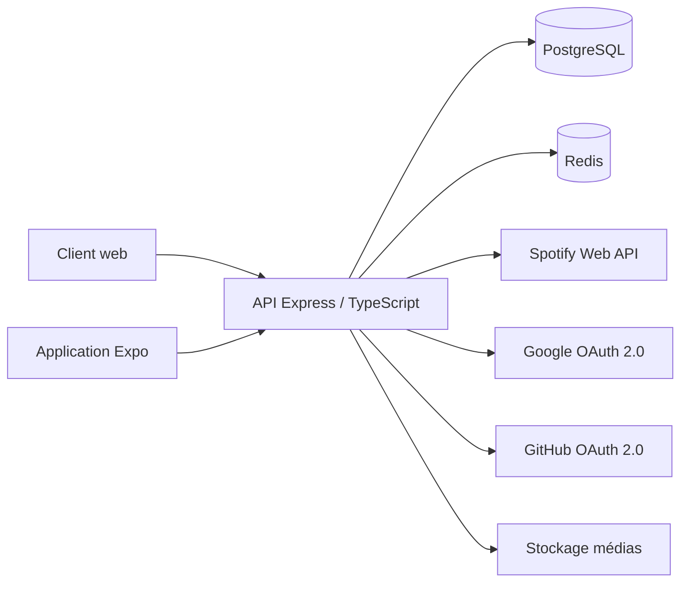

# Architecture technique

## Vue générale

SUPCONTENT Music suit une architecture client-serveur. Les clients web et
mobile utilisent la même API REST. Ils ne contactent jamais directement la
base de données ni les services OAuth.



## Responsabilités

### Client web

- navigation responsive ;
- affichage du catalogue musical et des profils ;
- gestion de la bibliothèque, des critiques et du réseau social ;
- chat, live, boutique, paramètres et administration ;
- lecteur global pour les aperçus disponibles.

### Application mobile

- inscription, connexion et session persistante ;
- recherche et détail média ;
- bibliothèque et collections ;
- critiques et commentaires ;
- fil, notifications et recherche de membres ;
- boutique, favoris, panier et publication ;
- profil utilisateur.

### API

- validation des entrées avec Zod ;
- authentification JWT et OAuth ;
- contrôle des autorisations ;
- accès PostgreSQL ;
- cache Redis des réponses musicales ;
- adaptation des réponses Spotify ;
- documentation OpenAPI disponible sur `/docs`.

## Choix techniques

| Technologie | Rôle | Justification |
|---|---|---|
| Express + TypeScript | API REST | écosystème mature et typage du serveur |
| PostgreSQL | persistance | relations, transactions et contraintes |
| Redis | cache | réduction des appels Spotify et des erreurs 429 |
| React Native + Expo | mobile | base commune Android/iOS |
| Vite + JavaScript | web | développement rapide et pages légères |
| Docker Compose | exécution locale | environnement reproductible |
| JWT + OAuth 2.0 | sécurité | session API et connexion externe |

## Sécurité

- mots de passe hachés avec `bcrypt` ;
- access tokens courts et refresh tokens révocables ;
- secrets chargés par variables d'environnement ;
- CORS limité aux origines configurées ;
- Helmet et politique CSP sur l'API ;
- validation des formats et tailles d'upload ;
- contrôle de propriété avant modification ou suppression ;
- séparation des routes publiques, authentifiées et administratives.

## Données musicales

Les œuvres restent identifiées par leur type et leur identifiant externe :

```text
media_type: track | album | artist
media_id: identifiant Spotify
```

Cette méthode évite de recopier tout le catalogue Spotify dans PostgreSQL.
La base conserve uniquement les interactions propres à l'application.

