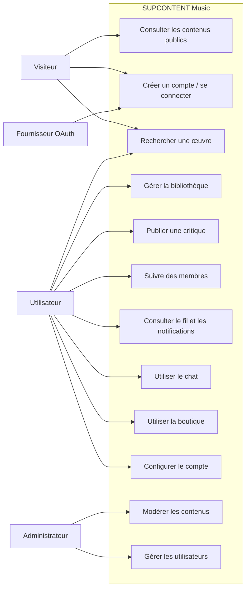
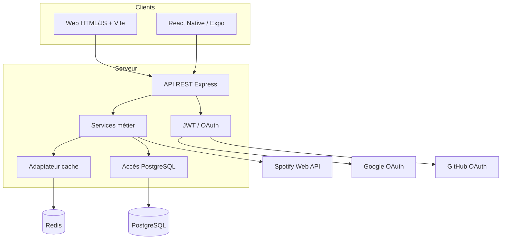
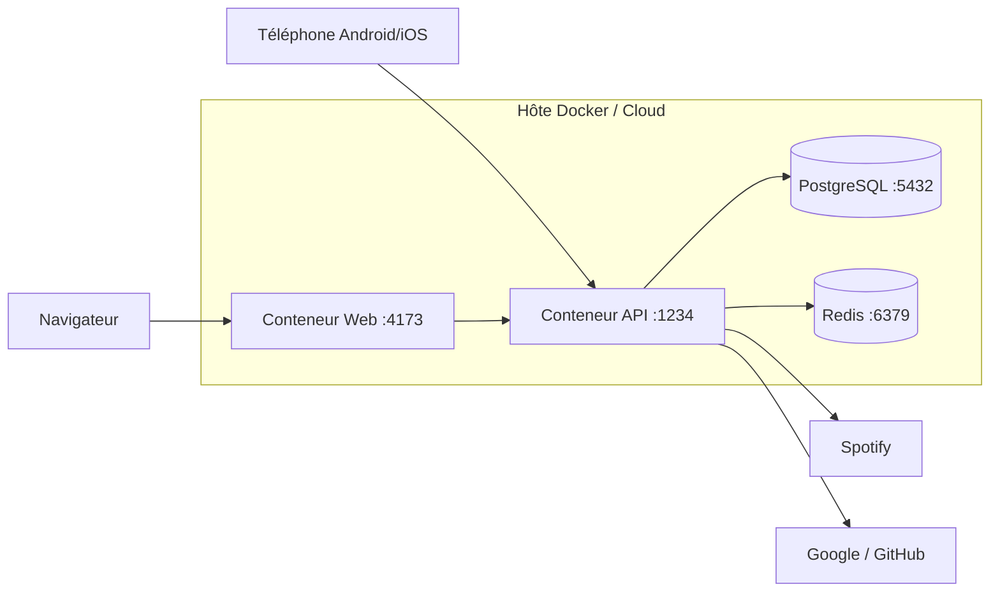
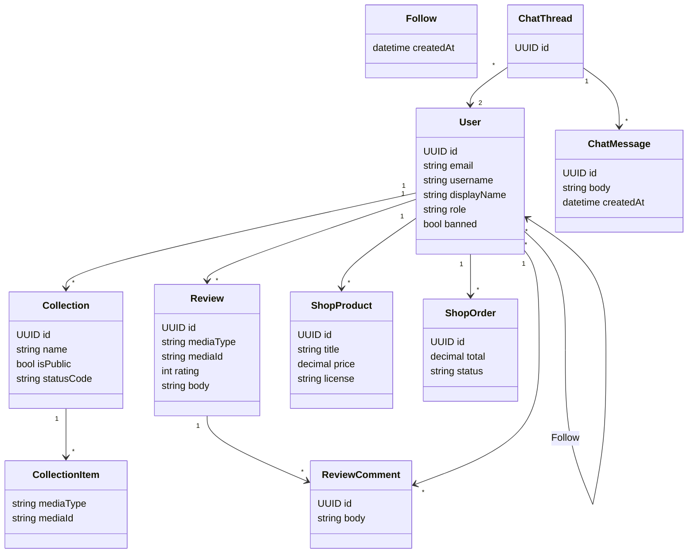
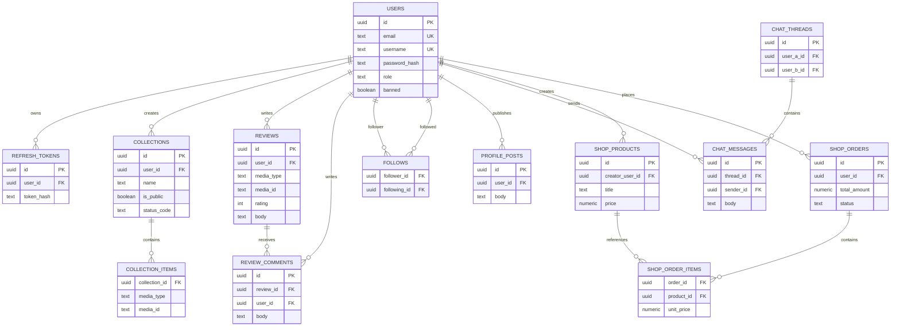
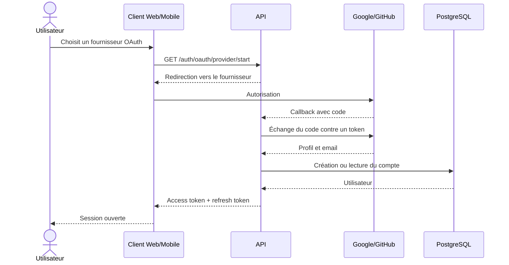
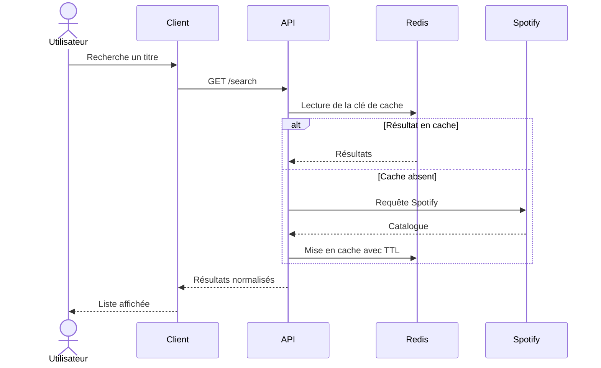
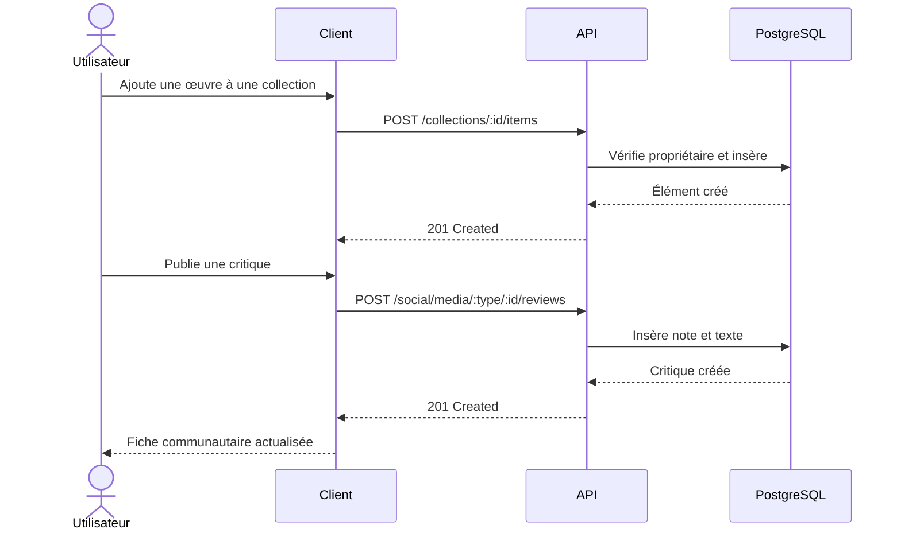

# Diagrammes UML et données

## Cas d'utilisation

## Diagramme de composants

## Diagramme de déploiement

## Diagramme de classes métier

## Modèle de données

## Séquence de connexion OAuth

## Séquence de recherche Spotify

## Séquence bibliothèque et critique

